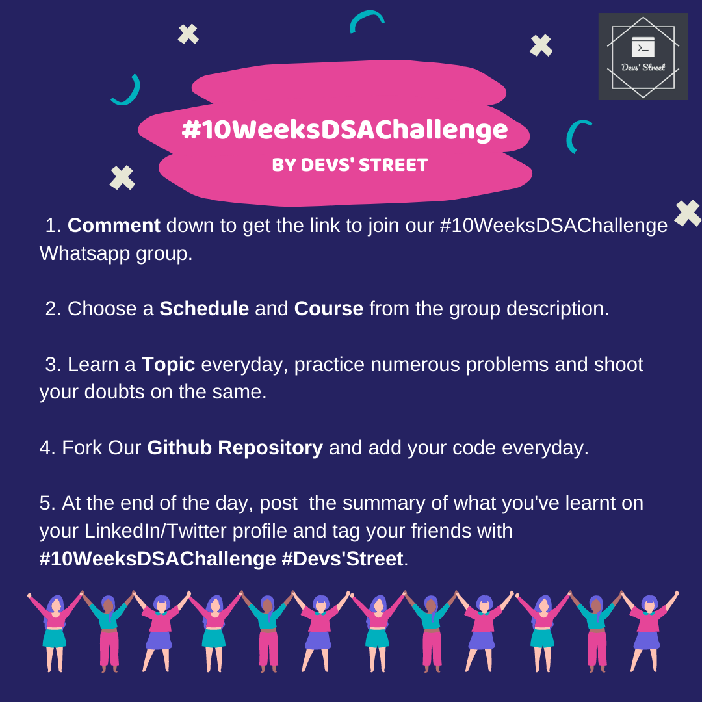

# 10-Weeks-DSA-Challenge
### A 10 weeks Data Structures And Algorithms Challenge organized by Devs' Street.
 
 
## How can I Participate?
  

   
## Takeaways?
<ul>
  <li>Tons of Free learning Resources and Schedule designed by professionals.</li>

  <li>24/7 doubt clearance by the team.</li>

  <li>Free Digital Badges every 10 days on maintaining the streak.</li>

  <li>Special mention and Certificate on completing the challenge successfully.</li>
  </ul>
  
## Who Can Participate? 

This challenge is Beginner friendly and focuses more on learning Data Structures and Algorithms from scratch. 
So, anyone who was struck learning DSA half-way or wants to start learning from the beginning can join our Challenge.
